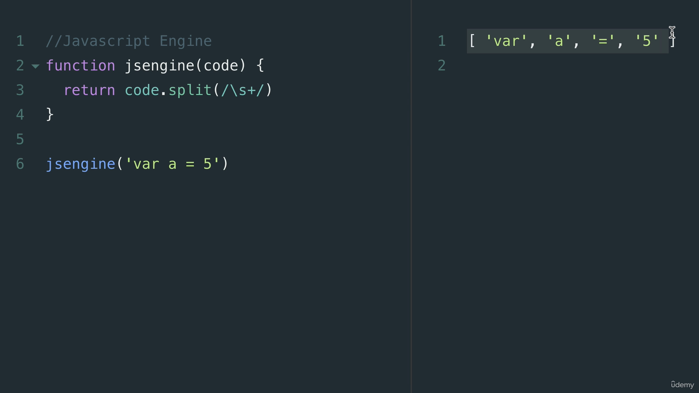

# JavaScript 引擎

## 什麼是 JavaScript 引擎？

JavaScript 引擎是一個用來將 JavaScript 程式碼翻譯成計算機可以理解的語言。最常見的 JavaScript 引擎是 Google 的 V8 引擎，它是用 C++ 語言編寫的。


## JavaScript 引擎的工作原理

- 詞彙分析（Lexical Analysis）：這一步驟將程式碼拆分成標記，以辨識其含義，了解程式碼的目的。
- 抽象語法樹（Abstract Syntax Tree，AST）：將這些標記組織成樹狀結構，以表示程式碼的結構和語法關係。


- 還有 interpreter、profiler、compiler 等等，之後再補充。


### 模擬 JavaScript 引擎

```javascript
function jsEngine(code) {
  return code.split(/\s+/);
}

jsEngine('var a = 5');
```

如同上述程式碼所示，JavaScript 引擎會將程式碼拆分成標記。



## ECMAScript 規範

前面提到 JavaScript 引擎可以自己創建，但是這樣的話，就會有很多的引擎，這樣會造成很多問題，例如：程式碼在不同的引擎上執行的結果不同，這樣就會造成很多問題，所以就有了 ECMAScript 規範，這樣就可以讓所有的引擎都遵循同一個規範，這樣就可以避免很多問題。

## interpreters 和 compilers

這段逐字稿的重點可以總結如下：

1. **直譯器與編譯器的作用**：在 JavaScript 引擎中，直譯器和編譯器是重要的組件。這兩種機制都用於將程式碼翻譯成計算機可以理解的語言，並不僅限於 JavaScript，也適用於其他多數程式語言，如 Python、Java 和 C++。

2. **直譯器的運作方式**：直譯器會逐行讀取並即時翻譯程式碼。例如，在一個簡單的迴圈中，直譯器會一行一行地執行程式碼，並重複計算直到迴圈結束。

3. **編譯器的運作方式**：與直譯器不同，編譯器不是即時執行，而是預先將整個程式碼翻譯成一種更接近機器語言的形式。編譯器會對程式碼進行一次完整的分析，並將其轉換成一種新的程式語言，這通常是一種低階語言，比如機器碼。

4. **語言的解釋與編譯**：實際上，大多數程式語言在某種程度上既需要解釋也需要編譯。高階語言（如 JavaScript）首先通過直譯器或編譯器處理，然後轉換成可以直接由 CPU 執行的低階語言或機器碼。

5. **為何選擇直譯或編譯**：這部分引發了關於為什麼選擇使用直譯器或編譯器的討論，包括它們各自的優缺點。這個問題預計將在下一段課程中進一步探討。

這些重點幫助理解 JavaScript 引擎中直譯器和編譯器的基本功能和重要性，以及它們如何影響程式碼的執行和效能。這為了解如何撰寫優化的 JavaScript 程式碼提供了基礎。

## Babel 和 TypeScript

- Babel is a Javascript compiler that takes your modern JS code and returns browser compatible JS (older JS code).
- Typescript is a superset of Javascript that compiles down to Javascript.

Both of these do exactly what compilers do: Take one language and convert into a different one!

## Inside the V8

> FROM: [13. Inside the V8 Engine | JavaScript: The Advanced Concepts (2023 Update)](https://www.udemy.com/course/advanced-javascript-concepts/learn/lecture/13760060#overview)

1. **直譯器的優缺點**：直譯器能快速啟動並運行程式碼，適合於即時執行的情況，如在瀏覽器中運行 JavaScript。不過，直譯器在重複執行相同程式碼時效率較低，尤其在迴圈結構中容易變慢。

2. **編譯器的優缺點**：編譯器在執行前需要時間編譯程式碼，但一旦編譯完成，運行速度通常會更快。它能夠進行優化，比如簡化重複程式碼，提高效率。

3. **混合直譯器和編譯器的方法**：為了結合兩者的優點，工程師們開發了「即時編譯器」（JIT Compiler），它在初次執行程式碼時使用直譯器，然後逐漸將頻繁執行的程式碼部分轉交給編譯器優化。

4. **V8 引擎的 JIT 編譯器**：V8 引擎使用 JIT 編譯器來優化 JavaScript 程式碼的執行。初次程式碼解析後，它會被直譯器處理，產生位元組碼（bytecode），這過程稱為 ignition。同時，一個分析器（或監視器）（profiler）會監控程式碼執行，並將可以優化的部分傳遞給 JIT 編譯器（稱為「TurboFan」），以提高執行效率。

5. **編譯器的持續優化**：JIT 編譯器會持續監控和優化程式碼，根據執行過程中的數據和行為進行調整，以確保程式碼運行盡可能快速高效。

6. **編寫優化程式碼的重要性**：了解 JavaScript 引擎的工作原理有助於開發者編寫更優化的程式碼，避免混淆編譯器，從而提高程式碼執行效率。

這些重點解釋了 JavaScript 引擎中直譯器和編譯器的不同角色，以及如何通過 JIT 編譯器結合兩者的優勢，提高程式碼執行效率。此外，它強調了為何開發者需要了解這些機制，以便編寫更有效率的 JavaScript 程式碼。


```javascript
function someCalculation(x, y) {
  return x + y;
}

for (let i = 0; i < 1000; i++) {
  someCalculation(5, 4);
}
```

以上程式碼對於直譯器和編譯器會有不同的解讀：

1. 直譯器：每次迴圈都會執行 `someCalculation` 函式，所以會執行 1000 次。
2. 編譯器：會將 `someCalculation` 函式優化成 `9`，所以只會執行一次。
   編譯器很聰明會優化程式碼，實際上可能會將上面程式碼變成

```javascript
function someCalculation(x, y) {
  return 9;
}
```


## 14. Comparing Other Languages

> FROM: [14. Comparing Other Languages | JavaScript: The Advanced Concepts (2023 Update)](https://www.udemy.com/course/advanced-javascript-concepts/learn/lecture/13760062#overview)

<!--
```plaintext
I wanted to do a quick video to see how what we just learned applies to different languages.

For example, you might have heard of an executable file that is a dot exe file.

Especially if you've ever used windows before.

You double click a file that ends in XY and then the code starts running, the application starts running

and that dot xy is an executable.

And most of the time these dot x files are created by C++.

You write a C++ code and you compile it to a dot x file.

For example, you can use a command like G plus plus your.

Program.

Dot C++.

So that's your C++ file and you're going to output it.

To an executable.

Your program.

And this is going to create that DOT esque file that you compile down.

From C++ to an executable machine code so that when you double click a file that is your program, it's

going to run because it's been compiled.

Now when you use a program like, let's say Java, Java, on the other hand, uses something called

the Java or Java virtual machine where it compiles your code or interprets your code to bytecode inside

of this JVM and this Java virtual machine is going to understand this byte code.

So unlike a compiled language that has to be compiled for each specific type of computer, a Java program

only needs to be converted to bytecode once, and that bytecode can be understood by the Java virtual

machine.

And that's where the term for Java write once run everywhere came from.

Now, one thing to note here is that bytecode is not a native machine code.

That is, most computers won't understand this byte code.

They might understand machine code, but not byte code.

So with byte code, you need software such as the virtual machine or a JavaScript engine so it can execute

it directly.

I can't double click a byte code file and run it without an engine or a JavaScript machine.

So I have a question for you, knowing what you just learned now.

Is JavaScript an interpreted language?

You'll hear this a lot.

JavaScript is an interpreted language, but learning what you just did.

Is JavaScript an interpreted language?

I mean, yes.

Initially, when JavaScript first came out, you had JavaScript engines such as Spider Monkey created

by Brendan Eich that interpreted JavaScript to bytecode, and that engine was able to run inside of

our browsers to tell our computers what to do.

But things have evolved now.

We don't have just interpreters.

We also use compilers to optimize this code.

So this is a common misconception.

When somebody says JavaScript is an interpreted language, yes, there is some truth to it.

But it actually depends on the implementation.

You can make an implementation of JavaScript of the JavaScript engine that perhaps only compiles.

And by the way, this is also true when it comes to something like Python.

Python can be run through a compiler or it can also be interpreted, even interpreted through something

like the Java virtual machine.

So it all matters depending on implementation.

So the next time somebody tells you, Hey, JavaScript, that's an interpreted language.

You can sound super smart and nitpicky by saying, well, not technically.

Technically it depends on the implementation.

All right.

I'll see you in the next video.

Bye bye.
``` -->


- bytecode 不是 machine code，所以需要 JavaScript Engine 來執行。
- JavaScript 是 interpreted language 嗎？
  - 一開始，JavaScript 是 interpreted language，但現在不一定了，因為現在加上 compiler 來優化程式碼了。

## 15. Writing Optimized Code

> FROM: [15. Writing Optimized Code | JavaScript: The Advanced Concepts (2023 Update)](https://www.udemy.com/course/advanced-javascript-concepts/learn/lecture/13760064#overview)

<!--
```plaintext
Welcome back.

Why do we just learn all of this?

Well, because now we know a critical part in being a JavaScript programmer.

We want to write code in a way that helps the compiler make optimizations.

We don't want to work against it and make things slow.

Throughout the rest of the course, we're going to learn different ways to write efficient code.

But I want to give you some basic things to watch out for when working with JavaScript engine.

Now keep in mind that most of these things I'm going to show you will seem like things you don't really

use or see that much anymore.

And that's because most developers don't use them since they can be bad for optimizations.

But it never hurts to know what they are.

It doesn't mean that you should never use them, but that the use cases for them are very rare.

So here's the list.

In order to help the JavaScript engine, we want to be really, really careful with these on the left.

Functions that call literally the eval function which comes with JavaScript can be very problematic.

Arguments which we're going to talk about when we get into functions of this course, something that

comes with every function.

There are many ways that we can use this keyword by JavaScript, but there are many ways that makes

compilers on optimizing able.

So we have to be really careful with using arguments and I'll show you later on how we can use parameter

de structuring to avoid using arguments.

Foreign loop for example, when looping over objects can also be problematic sometimes.

So I like to use object keys and iterate over the object keys.

That way the width statement which once again you don't see very often in the wild anymore, is another

problematic one.

And also the delete keyword in JavaScript can be problematic.

Now I'll leave resources for you to read up on them if you really, really want to get into the weeds.

But there's two main things I want to talk about here that are the main reasons that these things in

JavaScript can make our code less optimized.

Let's have a look.

The first thing I want to talk about is something called inline caching.

And in-line caching, we can demonstrate this way.

Let's say we have a function and this function will say find user that takes in the user parameter.

And this function will just return a template string say found.

Let's say a user got first name.

Then.

Last name.

And here we can just create an object, call it user data that will have the first name.

Say Johnson.

And last name.

Say Junior.

Now all we do here is say find user and give it the user data object.

Now inline caching does something really interesting.

Due to inline caching done by the compiler code that executes the same method repeatedly, that is,

let's say the find user method or function was being called multiple times.

Well, the compiler can optimize this so that whenever it's looking for the user data, which has first

name and last name, it can use something called inline caching.

Where instead of looking up this object every time, finding the key that is first name and last name,

and then the values it will cache or inline cache.

So that find user just becomes this piece of text.

So if we call find user over and over and over, we would just replace that with found Johnson Jr.

Because at the end of the day, that's all that the function is doing.

The other one that is really important for optimizing compiler code is something called hidden classes.

And a lot of the gotchas that I showed you previously, that is this one over here, such as the delete

key word really affects this hidden classes when it comes to compilers.

Let's have a look.

If I had a function, let's call it animal that receives X and Y parameters and we'll use this keyword

for now.

We're going to learn more about that soon in this course.

Don't worry.

But let's say we just have this animal.

With X and Y properties.

And now we create a new object.

Let's say cost object one is going to be a new animal.

That takes in one and two.

As the property doesn't really mean much, but there's our first object and then our second object.

We'll do the same thing, but this time with different parameters.

Three and four.

Now a compiler is going to take a look at this and say, all right, we have an animal that we're creating

here and we're assigning it to object one and object to.

But if I go ahead and add object one dot a.

To equal, let's say, 30.

And then object one dot B to equal 100.

And I'll do the same thing for the object too.

Except that this time around for.

Object to.

I'm going to create it in different order.

So that is I add the B property and then the A property to object to.

Hopefully that's not too confusing.

That code is actually going to make the compiler run slower or d optimize the code.

And that is something called hidden classes.

You want to try and instantiate your object properties in the same order so that hidden classes, which

is what the compiler uses underneath the hood to say, Oh, this animal class, this object one and

object two objects have the same hidden class.

That is, they have the same properties.

But as soon as you start introducing things in different orders, it's going to get confused and say,

Hmm, they don't have a shared hidden class.

They're two separate things.

And internally that's actually going to slow things down.

So one thing you want to do in a situation like this is to assign all properties of an object in its

constructor over here.

So that is to add the A and B property in here so that you avoid this issue.

Or making sure that we add things in the same order.

And that's why there's this issue of delete keyword as well.

If I delete the property here, all of the object.

Well, again, I changed the hitting classes so that they don't match up anymore.

Now when it comes to optimizing the compiler, there's small little gotchas like that that you don't

really have to worry too much about it.

The key takeaway from here is that we should write code that is predictable not only for humans, but

also for machines.

The more predictable your code is, the better it will be because will have no surprises.

And throughout the course we're going to learn these practices that will help us write optimized code

that is predictable and that doesn't confuse the compiler.

I'm not going to mention every single time that we're doing an optimization for the compiler.

We're just going to assume that these best practices when incorporated, like I'm going to show you

throughout the course, it's going to help us write fast, efficient code.

I'll leave resources for you here if you want to learn a little bit more about this topic and really

get into understanding what this hidden classes is.

It isn't something that you need to worry about too much.

But for now, I'll see you in the next video.

Bye bye.
``` -->

- inline caching：當一個函式多次被調用時，編譯器會將函式的結果儲存起來，這樣就不用每次都執行函式了。

```javascript
function findUser(user) {
  return `found ${user.firstName} ${user.lastName}`;
}

const userData = {
  firstName: 'Alice',
  lastName: 'Wang',
};

console.log(findUser(userData));
```

以上程式碼會被編譯器優化成：

```javascript
console.log('found Alice Wang');
```

- hidden classes：

```javascript
function Animal(x, y) {
  this.x = x;
  this.y = y;
}

const obj1 = new Animal(1, 2);
const obj2 = new Animal(1, 2);

obj1.a = 30;
obj1.b = 100;
obj2.b = 30;
obj2.a = 100;
```

以上程式碼會讓編譯器運行速度變慢或 d-optimize 程式碼。
