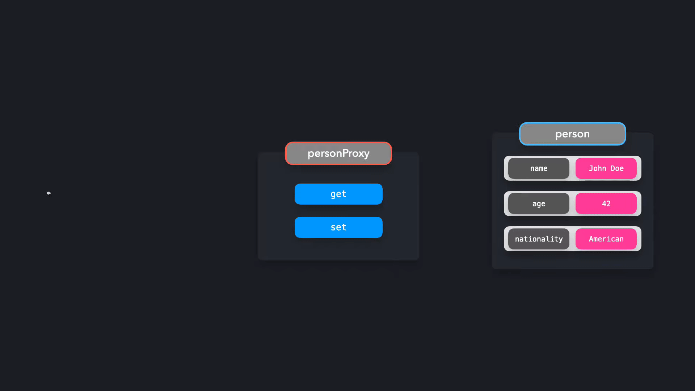

# Proxy

With a Proxy object, we get more control over the interactions with certain objects. A proxy object can determine the behavior whenever we’re interacting with the object, for example when we’re getting a value, or setting a value.

透過代理物件，我們可以對與特定物件的互動有更多控制。代理物件可以在我們與該物件互動時，例如在取得或設定值時，決定行為。

---

Generally speaking, a proxy means a stand-in for someone else. Instead of speaking to that person directly, you’ll speak to the proxy person who will represent the person you were trying to reach. The same happens in JavaScript: instead of interacting with the target object directly, we’ll interact with the Proxy object.

一般來說，代理意味著代表別人。你不直接與那個人談話，而是與代理人談話，代理人會代表你原本想接觸的那個人。在 JavaScript 中也是如此：我們不直接與目標物件互動，而是與代理物件互動。

---

Let’s create a person object, that represents John Doe.

讓我們創建一個代表 John Doe 的人物物件。

```js
const person = {
  name: 'John Doe',
  age: 42,
  nationality: 'American',
};
```

Instead of interacting with this object directly, we want to interact with a proxy object. In JavaScript, we can easily create a new proxy by creating a new instance of **`Proxy`**.

我們想要與代理物件互動，而不是直接與這個物件互動。在 JavaScript 中，我們可以輕鬆地透過創建 **`Proxy`** 的新實例來創建新的代理。

```js
// const proxy1 = new Proxy(target, handler);
const personProxy = new Proxy(person, {});
```

The second argument of **`Proxy`** is an object that represents the handler. In the handler object, we can define specific behavior based on the type of interaction. Although there are [many methods](https://developer.mozilla.org/en-US/docs/Web/JavaScript/Reference/Global_Objects/Proxy) that you can add to the Proxy handler, the two most common ones are **`get`** and **`set`**:

**`Proxy`** 的第二個參數是一個代表處理器的物件。在處理器物件中，我們可以根據互動類型定義特定行為。雖然你可以為 Proxy 處理器添加許多方法，但最常見的兩個是 **`get`** 和 **`set`**：

- **`get`**: Gets invoked when trying to **access** a property
  **`get`**：在嘗試**訪問**屬性時被呼叫
- **`set`**: Gets invoked when trying to **modify** a property
  **`set`**：在嘗試**修改**屬性時被呼叫

Effectively, what will end up happening is the following:

實際上，最終會發生以下情況：



Instead of interacting with the **`person`** object directly, we’ll be interacting with the **`personProxy`**.

我們將與 **`personProxy`** 互動，而不是直接與 **`person`** 物件互動。

Let’s add handlers to the **`personProxy`** Proxy. When trying to modify a property, thus invoking the **`set`** method on the **`Proxy`**, we want the proxy to log the previous value and the new value of the property. When trying to access a property, thus invoking the **`get`** method on the **`Proxy`**, we want the proxy to log a more readable sentence that contains the key and value of the property.

讓我們為 **`personProxy`** 代理添加處理器。當嘗試修改一個屬性，從而調用 **`Proxy`** 上的 **`set`** 方法時，我們希望代理記錄該屬性的先前值和新值。當嘗試訪問一個屬性，從而調用 **`Proxy`** 上的 **`get`** 方法時，我們希望代理記錄一個包含屬性鍵和值的更易讀的句子。

```js
const personProxy = new Proxy(person, {
  get: (obj, prop) => {
    console.log(`The value of ${prop} is ${obj[prop]}`);
  },
  set: (obj, prop, value) => {
    console.log(`Changed ${prop} from ${obj[prop]} to ${value}`);
    obj[prop] = value;
  },
});
```

Perfect! Let’s see what happens when we’re trying to modify or retrieve a property.

太棒了！讓我們看看在嘗試修改或檢索屬性時會發生什麼。

```js
const person = {
  name: 'John Doe',
  age: 42,
  nationality: 'American',
};

const personProxy = new Proxy(person, {
  get: (obj, prop) => {
    console.log(`The value of ${prop} is ${obj[prop]}`);
  },
  set: (obj, prop, value) => {
    console.log(`Changed ${prop} from ${obj[prop]} to ${value}`);
    obj[prop] = value;
  },
});

personProxy.name; // Prints: The value of name is John Doe
personProxy.age = 43; // Prints: Changed age from 42 to 43
```

When accessing the **`name`** property, the Proxy returned a better sounding sentence: **`The value of name is John Doe`**.

當訪問 **`name`** 屬性時，代理回傳了一個更好聽的句子：**`The value of name is John Doe`**。

When modifying the **`age`** property, the Proxy returned the previous and new value of this property: **`Changed age from 42 to 43`**.

當修改 **`age`** 屬性時，代理回傳了此屬性的先前值和新值：**`Changed age from 42 to 43`**。

---

A proxy can be useful to add **validation**. A user shouldn’t be able to change **`person`**’s age to a string value, or give them an empty name. Or if the user is trying to access a property on the object that doesn’t exist, we should let the user know.

代理可以用於添加**驗證**。使用者不應該能將 person 的年齡更改為字串值，或給他們一個空白的名字。或者，如果使用者嘗試訪問物件上不存在的屬性，我們應該讓使用者知道。

```js
const personProxy = new Proxy(person, {
  get: (obj, prop) => {
    if (!obj[prop]) {
      console.log(`Hmm.. this property doesn't seem to exist on the target object`);
    } else {
      console.log(`The value of ${prop} is ${obj[prop]}`);
    }
  },
  set: (obj, prop, value) => {
    if (prop === 'age' && typeof value !== 'number') {
      console.log(`Sorry, you can only pass numeric values for age.`);
    } else if (prop === 'name' && value.length < 2) {
      console.log(`You need to provide a valid name.`);
    } else {
      console.log(`Changed ${prop} from ${obj[prop]} to ${value}.`);
      obj[prop] = value;
    }
  },
});
```

Let’s see what happens when we’re trying to pass faulty values!

讓我們看看在嘗試傳遞錯誤值時會發生什麼！

```js
const person = {
  name: 'John Doe',
  age: 42,
  nationality: 'American', // Taiwanese
};

const personProxy = new Proxy(person, {
  get: (obj, prop) => {
    if (!obj[prop]) {
      console.log(`Hmm.. this property doesn't seem to exist`);
    } else {
      console.log(`The value of ${prop} is ${obj[prop]}`);
    }
  },
  set: (obj, prop, value) => {
    if (prop === 'age' && typeof value !== 'number') {
      console.log(`Sorry, you can only pass numeric values for age.`);
    } else if (prop === 'name' && value.length < 2) {
      console.log(`You need to provide a valid name.`);
    } else {
      console.log(`Changed ${prop} from ${obj[prop]} to ${value}.`);
      obj[prop] = value;
    }
  },
});

personProxy.nonExistentProperty; // Prints: Hmm.. this property doesn't seem to exist
personProxy.age = '44'; // Prints: Sorry, you can only pass numeric values for age.
personProxy.name = ''; // Prints: You need to provide a valid name.
```

The proxy made sure that we weren’t modifying the person object with faulty values, which helps us keep our data pure!

代理確保我們不會使用錯誤的值修改 person 物件，這有助於我們保持資料的純淨！

---

## `Reflect` 物件

JavaScript provides a built-in object called **`Reflect`**, which makes it easier for us to manipulate the target object when working with proxies.

JavaScript 提供了一個內建物件 **`Reflect`**，它使我們在使用代理時更容易操作目標物件。

Previously, we tried to modify and access properties on the target object within the proxy through directly getting or setting the values with bracket notation. Instead, we can use the **`Reflect`** object. The methods on the **`Reflect`** object have the same name as the methods on the **`handler`** object.

之前，我們嘗試在代理中直接通過方括號訪問或設置值來修改和訪問目標物件上的屬性。相反，我們可以使用 **`Reflect`** 物件。**`Reflect`** 物件上的方法與 **`handler`** 物件上的方法同名。

Instead of accessing properties through **`obj[prop]`** or setting properties through **`obj[prop] = value`**, we can access or modify properties on the target object through **`Reflect.get()`** and **`Reflect.set()`**. The methods receive the same arguments as the methods on the handler object.

我們可以透過 **`Reflect.get()`** 和 **`Reflect.set()`** 來存取或修改目標物件上的屬性，而不是透過 **`obj[prop]`** 存取屬性或 **`obj[prop] = value`** 設置屬性。這些方法接收的參數與處理器物件上的方法相同。

```js
const personProxy = new Proxy(person, {
  get: (obj, prop) => {
    console.log(`The value of ${prop} is ${Reflect.get(obj, prop)}`);
  },
  set: (obj, prop, value) => {
    console.log(`Changed ${prop} from ${obj[prop]} to ${value}`);
    Reflect.set(obj, prop, value);
  },
});
```

Perfect! We can access and modify the properties on the target object easily with the **`Reflect`** object.

太好了！我們可以輕鬆地使用 **`Reflect`** 物件來存取和修改目標物件上的屬性。

```js
const person = {
  name: 'John Doe',
  age: 42,
  nationality: 'American',
};

const personProxy = new Proxy(person, {
  get: (obj, prop) => {
    console.log(`The value of ${prop} is ${Reflect.get(obj, prop)}`);
  },
  set: (obj, prop, value) => {
    console.log(`Changed ${prop} from ${obj[prop]} to ${value}`);
    Reflect.set(obj, prop, value);
  },
});

personProxy.name;
personProxy.age = 43;
personProxy.name = 'Jane Doe';
```

---

## 取捨 / Tradeoffs

Proxies are a powerful way to add control over the behavior of an object. A proxy can have various use-cases: it can help with validation, formatting, notifications, or debugging.

代理是增加對物件行為控制的強大方式。代理可以有多種用途：它可以幫助進行驗證、格式化、通知或除錯。

Overusing the **`Proxy`** object or performing heavy operations on each **`handler`** method invocation can easily affect the performance of your application negatively. It’s best to not use proxies for performance-critical code.

過度使用 **`Proxy`** 物件或在每次 **`handler`** 方法調用上執行大量操作，很容易對應用程式的效能產生負面影響。最好不要在效能關鍵程式碼中使用代理。

---

## 參考來源

- [Proxy - Refactoring.Guru](https://refactoring.guru/design-patterns/proxy)
- [Proxy Pattern - patterns.dev](https://www.patterns.dev/vanilla/proxy-pattern)
- [Proxy - MDN](https://developer.mozilla.org/en-US/docs/Web/JavaScript/Reference/Global_Objects/Proxy)

---

## 複習 Review

1. What is a proxy?
   什麼是代理？

   - A proxy is a stand-in for someone else. Instead of interacting with that person directly, you’ll interact with the proxy person who will represent the person you were trying to reach.

     代理是別人的替身。你不直接與那個人互動，而是與代理人互動，代理人會代表你原本想接觸的那個人。

2. In JavaScript, how can we create a proxy?
   在 JavaScript 中，我們如何創建代理？

   - We can create a proxy by creating a new instance of **`Proxy`**.

     我們可以通過創建 **`Proxy`** 的新實例來創建代理。

     - **`const proxy = new Proxy(target, handler);`**

       - **`target`**: the original object which you want to proxy
         **`target`**：你想要代理的原始物件
       - **`handler`**: an object that defines which operations will be intercepted and how to redefine intercepted operations
         **`handler`**：一個定義哪些操作將被攔截以及如何重新定義被攔截操作的物件

3. What are the two most common methods on the **`handler`** object?
   **`handler`** 物件上最常見的兩種方法是什麼？

   - **`get`** and **`set`**

     - **`get`**: Gets invoked when trying to **access** a property
       **`get`**：在嘗試**訪問**屬性時被呼叫
     - **`set`**: Gets invoked when trying to **modify** a property
       **`set`**：在嘗試**修改**屬性時被呼叫

4. What is the **`Reflect`** object?
   **`Reflect`** 物件是什麼？

   - The **`Reflect`** object is a built-in object that makes it easier for us to manipulate the target object when working with proxies.

     **`Reflect`** 物件是一個內建物件，它使我們在使用代理時更容易操作目標物件。

   - Instead of accessing properties through **`obj[prop]`** or setting properties through **`obj[prop] = value`**, we can access or modify properties on the target object through **`Reflect.get()`** and **`Reflect.set()`**.

     我們可以透過 **`Reflect.get()`** 和 **`Reflect.set()`** 來存取或修改目標物件上的屬性，而不是透過 **`obj[prop]`** 存取屬性或 **`obj[prop] = value`** 設置屬性。

5. What is a use-case for a proxy?
   代理的用例是什麼？

   - A proxy can have various use-cases: it can help with validation, formatting, notifications, or debugging.

     代理可以有多種用途：它可以幫助進行驗證、格式化、通知或除錯。

6. 給定 `person` 實作 `personProxy`，並且使用 `Reflect` 物件來存取或修改屬性。

```js
const person = {
  name: 'John Doe',
  age: 42,
  nationality: 'American',
};
```

```js
const proxy = new Proxy(person, {
  get: (obj, prop) => {
    console.log(`The value of ${prop} is ${Reflect.get(obj, prop)}`);
  },
  set: (obj, prop, value) => {
    console.log(`Changed ${prop} from ${obj[prop]} to ${value}`);
    Reflect.set(obj, prop, value);
  },
});
```

測試情境

```js
personProxy.nonExistentProperty; // Prints: Hmm.. this property doesn't seem to exist
personProxy.age = '44'; // Prints: Sorry, you can only pass numeric values for age.
personProxy.name = ''; // Prints: You need to provide a valid name.
```
