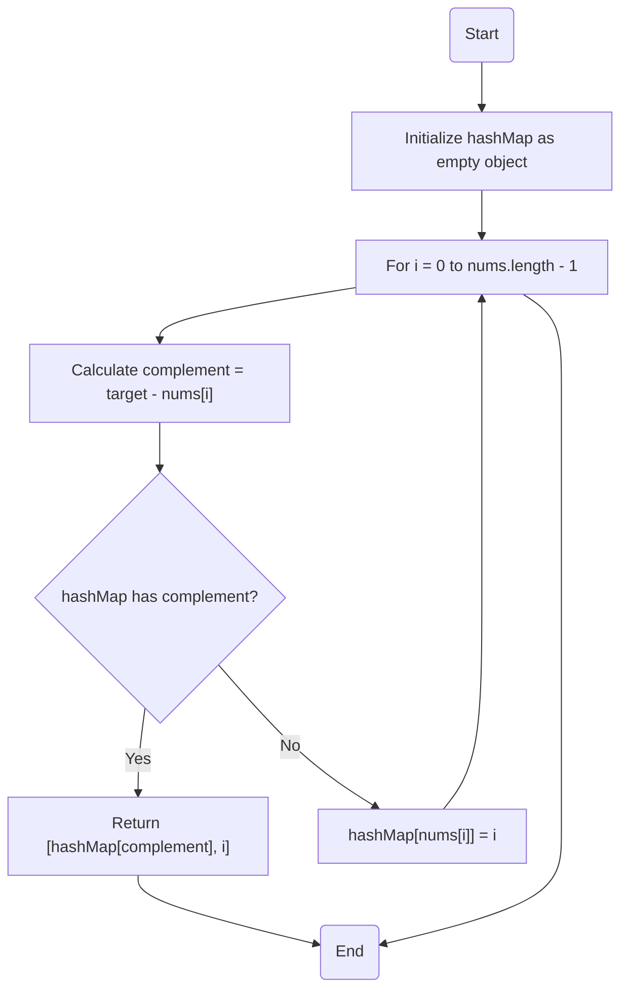

# 1. Two Sum

> @BirinderSingh: 如果面試官問了一個你不知道答案的問題，試著回答：「我認為這個問題用哈希表可以解決」。

## 題目說明

[LeetCode 題目連結](https://leetcode.com/problems/two-sum/)

- 這道題目是要找出陣列中兩個數字相加等於目標值的索引
- 每次輸入總是會有一組解答，也就是說不用考慮沒有解的情況

## 解題思路

1. 暴力法：
   - 雙層迴圈
   - 效率分析
     - 時間複雜度：O(n^2)
     - 空間複雜度：O(1)
       - 沒有使用額外的空間
2. hash map：**本題的解法**
   - 使用 hash map 來記錄已經用過的數字
     - 為什麼？**hash map 的查詢時間複雜度為 O(1)**
   - 遍歷時檢查 hash map 中是否有目標值減去當前數字的補數（complement）
     - 當前數字 + 補數 = 目標值 => nums[i] + complement = target
   - 效率分析
     - 時間複雜度：O(n)
       - 一層迴圈的時間複雜度為 O(n)
       - 為什麼？hash map 的查詢時間複雜度為 O(1)
     - 空間複雜度：O(n)
       - 使用了額外的空間來儲存 hash map

## 程式碼實作

### Python

```python
from typing import List

class Solution:
    def two_sum(self, nums: List[int], target: int) -> List[int]:
        hash_map = {}

        for i, num in enumerate(nums):
            complement = target - num
            if complement in hash_map:
                return [hash_map[complement], i]
            hash_map[num] = i

        return []
```

### TypeScript

```ts
function twoSum(nums: number[], target: number): number[] {
  const hashMap: Record<number, number> = {};

  for (let i = 0; i < nums.length; i++) {
    const complement = target - nums[i];
    if (hashMap.hasOwnProperty(complement)) {
      return [hashMap[complement], i];
    }
    hashMap[nums[i]] = i;
  }

  return [];
}
```

#### 流程圖



### JavaScript

```js
function twoSum(nums, target) {
  const hashMap = {};

  for (let i = 0; i < nums.length; i++) {
    const complement = target - nums[i];
    if (hashMap.hasOwnProperty(complement)) {
      return [hashMap[complement], i];
    }
    hashMap[nums[i]] = i;
  }

  return [];
}
```

## 討論

### 使用 JavaScript 的 Map 物件

- Map 物件是一種簡單的 key-value 配對的集合
- Map 物件允許 key 是任何型別，在這裡我們使用 number 作為 key，而常規的物件只能使用 string 作為 key（也可以使用 symbol）

```ts
function twoSum(nums: number[], target: number): number[] {
  const hashMap = new Map<number, number>();

  for (let i = 0; i < nums.length; i++) {
    const complement = target - nums[i];
    if (hashMap.has(complement)) {
      return [hashMap.get(complement)!, i];
    }
    hashMap.set(nums[i], i);
  }

  return [];
}
```

## 參考網站

- [NeetCode](https://www.youtube.com/watch?v=KLlXCFG5TnA&t=93s&ab_channel=NeetCode)
