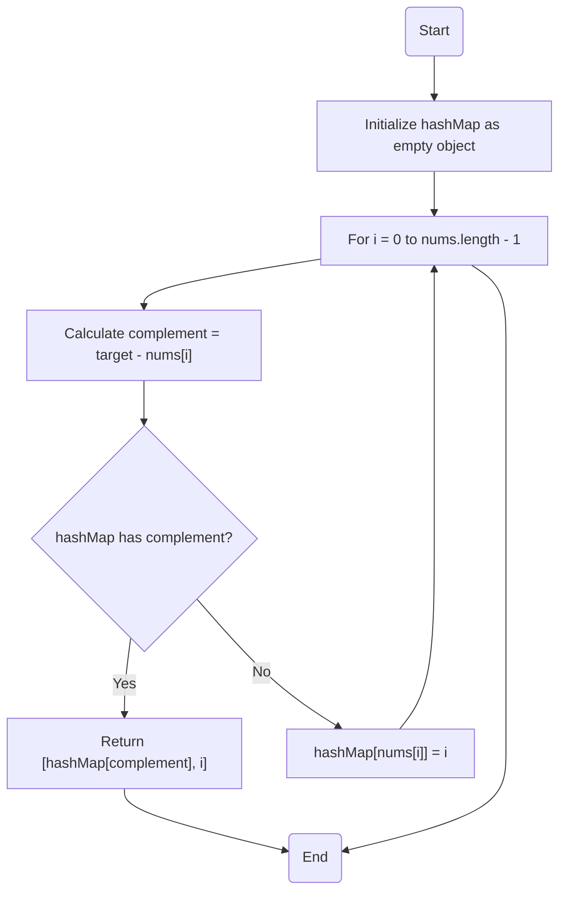

# 1. Two Sum

> @BirinderSingh: If the interviewer asks something and you don't know the answer, just answer "a hash map should do the trick".

## Problem Description

[LeetCode Problem Link](https://leetcode.com/problems/two-sum/)

- The problem is to find the indices of the two numbers in an array that add up to a specific target.
- There is always one solution for each input, meaning you don't have to consider the case where there is no solution.

## Solution Thoughts

1. Brute Force:
   - Nested loops
   - Efficiency Analysis
     - Time Complexity: O(n^2)
     - Space Complexity: O(1)
       - No extra space used
2. Hash Map: **The solution for this problem**
   - Use a hash map to keep track of the numbers we have seen
     - Why? **The lookup time complexity of a hash map is O(1)**
   - While iterating, check if the hash map contains the complement of the current number (complement)
     - Current number + Complement = Target => nums[i] + complement = target
   - Efficiency Analysis
     - Time Complexity: O(n)
       - The time complexity of a single loop is O(n)
       - Why? The lookup time complexity of a hash map is O(1)
     - Space Complexity: O(n)
       - Extra space is used to store the hash map

## Code Implementation

### Python

```python
from typing import List

class Solution:
    def two_sum(self, nums: List[int], target: int) -> List[int]:
        hash_map = {}

        for i, num in enumerate(nums):
            complement = target - num
            if complement in hash_map:
                return [hash_map[complement], i]
            hash_map[num] = i

        return []
```

### TypeScript

```ts
function twoSum(nums: number[], target: number): number[] {
  const hashMap: Record<number, number> = {};

  for (let i = 0; i < nums.length; i++) {
    const complement = target - nums[i];
    if (hashMap.hasOwnProperty(complement)) {
      return [hashMap[complement], i];
    }
    hashMap[nums[i]] = i;
  }

  return [];
}
```

#### Flowchart



### JavaScript

```js
function twoSum(nums, target) {
  const hashMap = {};

  for (let i = 0; i < nums.length; i++) {
    const complement = target - nums[i];
    if (hashMap.hasOwnProperty(complement)) {
      return [hashMap[complement], i];
    }
    hashMap[nums[i]] = i;
  }

  return [];
}
```

## Discussion

### Using JavaScript's Map Object

- The Map object is a simple key-value map collection.
- The Map object allows for keys of any type, here we use number as the key, whereas regular objects only allow strings as keys (symbols can also be used).

```ts
function twoSum(nums: number[], target: number): number[] {
  const hashMap = new Map<number, number>();

  for (let i = 0; i < nums.length; i++) {
    const complement = target - nums[i];
    if (hashMap.has(complement)) {
      return [hashMap.get(complement)!, i];
    }
    hashMap.set(nums[i], i);
  }

  return [];
}
```

## References

- [NeetCode](https://www.youtube.com/watch?v=KLlXCFG5TnA&t=93s&ab_channel=NeetCode)
